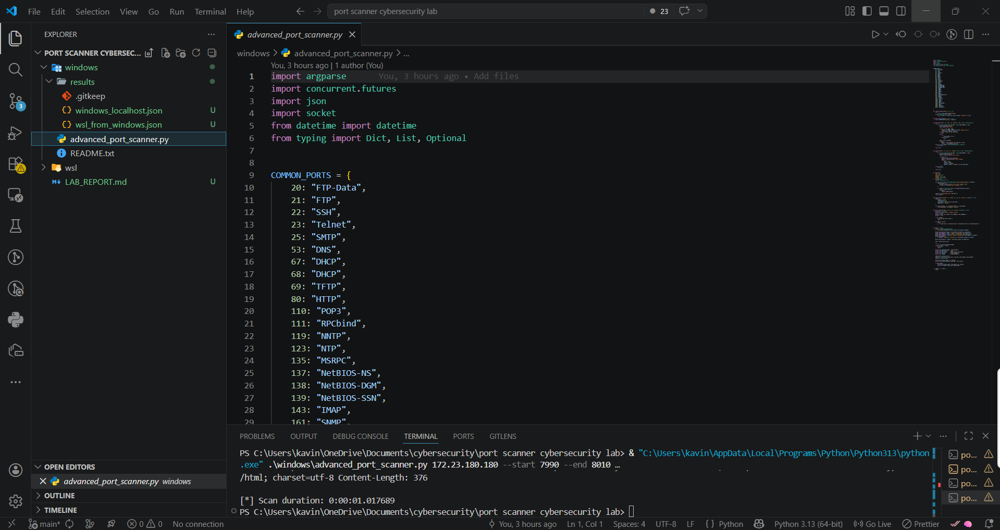
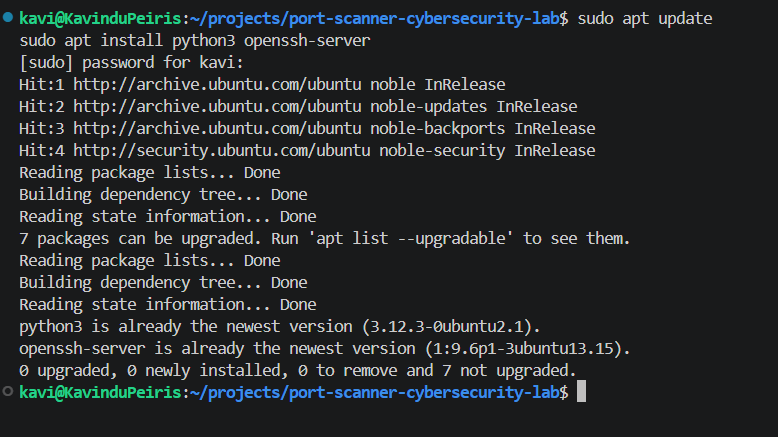
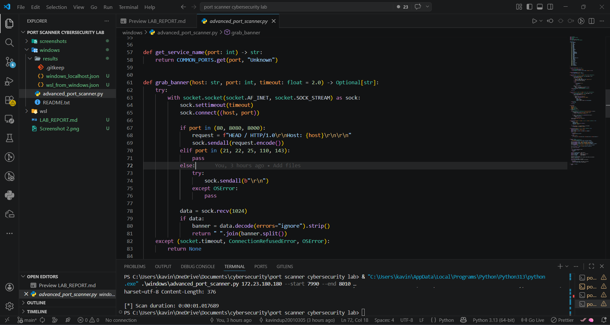
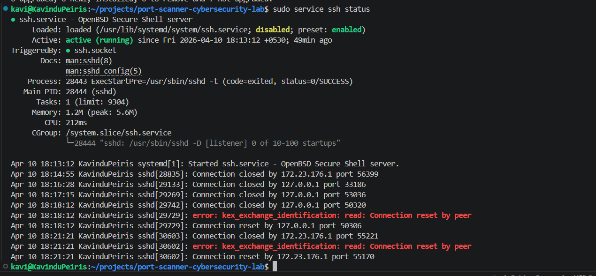
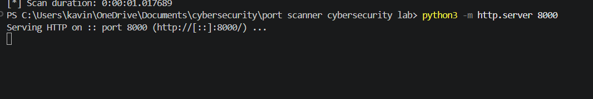
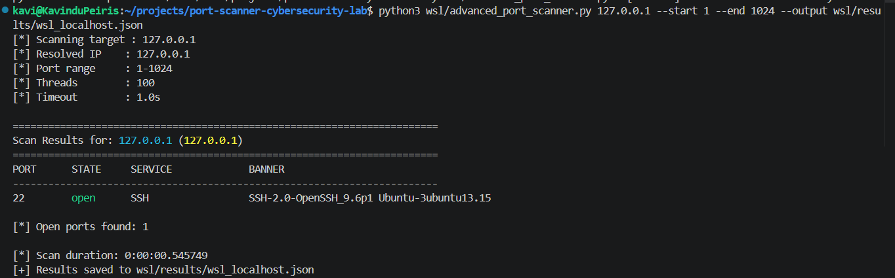
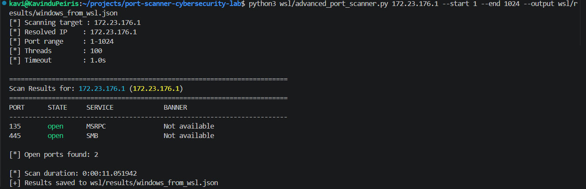
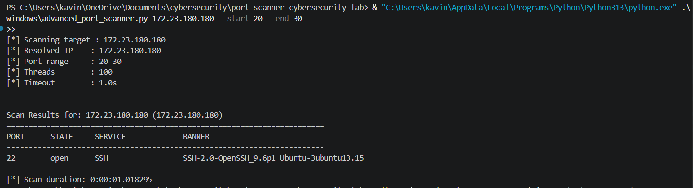
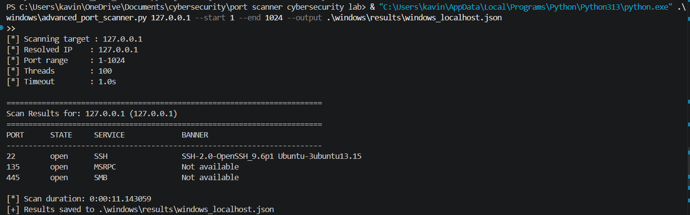
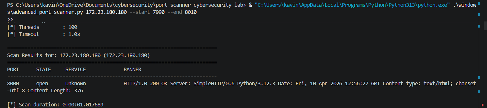

# Network Scanning Lab Report
## Advanced TCP Port Scanner with Banner Grabbing (Windows + WSL)

---

## Title
Development and Analysis of a TCP Port Scanner with Banner Grabbing in a Windows-WSL Hybrid Environment

---

## Aim
To design and implement a Python-based TCP port scanner capable of detecting open ports, identifying services, and performing banner grabbing, and to analyze its behavior in a Windows-WSL hybrid networking environment.

---

## Environment

- Host System: Windows (WSL-enabled)
- WSL Distribution: Ubuntu 24.04.4 LTS
- Tools Used:
  - Python 3
  - VS Code
  - Custom Python Port Scanner
  - Linux networking utilities

---

## Network Configuration

| Component | IP Address |
| --- | --- |
| Windows (WSL-side) | 172.23.176.1 |
| WSL Instance | 172.23.180.180 |

---

## Screenshot 1: Environment Setup




---

## Theory

### Port Scanning
Port scanning is a technique used to identify open ports on a system. Open ports indicate services actively listening for incoming connections.

### Service Identification
Each port typically corresponds to a service:

- 22 -> SSH
- 135 -> MSRPC
- 445 -> SMB

### Banner Grabbing
Banner grabbing involves connecting to a service and retrieving identifying information.

Example:

```text
SSH-2.0-OpenSSH_9.6p1 Ubuntu
```

---

## Procedure

### Step 1: Environment Setup

Installed required tools in WSL:

```bash
sudo apt update
sudo apt install python3 openssh-server
```

Screenshot 2: Package installation output



---

### Step 2: Scanner Development

The Python scanner was developed in VS Code and implemented the following:

- TCP connection scanning
- Service detection using common ports
- Banner grabbing using socket communication
- Multithreading for faster scanning

Screenshot 3: Scanner code in VS Code



---

### Step 3: Service Setup

#### SSH Service

- SSH service was successfully started in WSL
- The service was later verified through scan results

Screenshot 4: `sudo service ssh status`



#### HTTP Server Attempt

An HTTP server was attempted with:

```bash
python3 -m http.server 8000
```

Observed error:

```text
OSError: [Errno 98] Address already in use
```

This indicates that port 8000 was already occupied by another process.

Screenshot 5: HTTP server error



---

## Results

### 1. Localhost Scan (WSL)

- Target: `127.0.0.1`
- Timestamp: `2026-04-10 18:18:13`

| Port | State | Service | Banner |
| --- | --- | --- | --- |
| 22 | open | SSH | SSH-2.0-OpenSSH_9.6p1 Ubuntu-3ubuntu13.15 |

Screenshot 6: Localhost scan output



---

### 2. WSL to Windows Scan

- Target: `172.23.176.1`
- Timestamp: `2026-04-10 18:20:34`

| Port | State | Service | Banner |
| --- | --- | --- | --- |
| 135 | open | MSRPC | Not available |
| 445 | open | SMB | Not available |

Screenshot 7: WSL to Windows scan output



---

### 3. Windows to WSL Scan

- Target: `172.23.180.180`
- Status: No open ports found during the recorded scan

This can occur when no WSL service is listening on externally reachable interfaces at the time of the scan, or when the relevant service was not yet started.

Screenshot 8: Windows to WSL scan output



---

### 4. Windows Localhost Scan

- Target: `127.0.0.1`

| Port | State | Service | Banner |
| --- | --- | --- | --- |
| 22 | open | SSH | SSH-2.0-OpenSSH_9.6p1 Ubuntu-3ubuntu13.15 |
| 135 | open | MSRPC | Not available |
| 445 | open | SMB | Not available |

This localhost result shows that Windows could observe an SSH service exposed locally in addition to normal Windows services.

Screenshot 9: Windows localhost scan output



---

### 5. HTTP Service Test

- HTTP service could not be confirmed due to port conflict
- Port `8000` was already in use

Screenshot 10: HTTP test or port conflict evidence



---

## Analysis

### SSH Detection

Port 22 was detected successfully and the banner was retrieved:

```text
SSH-2.0-OpenSSH_9.6p1 Ubuntu-3ubuntu13.15
```

This confirms:

- the SSH service was active
- the scanner was able to retrieve version information

---

### Windows Services Detected

From the WSL-to-Windows scan, the following common Windows services were identified:

- Port 135: MSRPC
- Port 445: SMB

These are standard Windows networking services and are often visible within local lab environments.

---

### Banner Grabbing Limitations

For MSRPC and SMB, the scanner returned:

```text
Not available
```

This is expected because:

- some protocols do not send human-readable banners
- some require protocol-specific negotiation
- some are binary or structured rather than text-based

---

### WSL Networking Behavior

The experiment highlighted typical WSL networking behavior:

- WSL commonly uses NAT-based networking
- it behaves similarly to a lightweight virtualized environment
- some ports may not be externally visible depending on how services are bound
- scan results can vary depending on whether the target service is listening on `127.0.0.1` only or on all interfaces

---

### HTTP Server Issue

The HTTP server test did not complete as expected because port `8000` was already in use. Possible causes include:

- another process already bound to port 8000
- a previous Python server instance still running
- a background service using that port

---

## Limitations

- Only TCP scanning was implemented
- UDP scanning was not included
- Banner grabbing is limited to simple responses
- No OS fingerprinting was performed
- Accuracy depends on active services and protocol behavior
- WSL networking can limit external visibility of services

---

## Comparison with Nmap

| Feature | Custom Scanner | Nmap |
| --- | --- | --- |
| Port scanning | Yes | Yes |
| Service detection | Basic | Advanced |
| Banner grabbing | Limited | Detailed |
| Speed | Moderate | Fast |
| Accuracy | Moderate | High |

Screenshot 11: Nmap output (optional)

---

## Conclusion

The Python-based port scanner successfully identified open ports and performed basic service detection and banner grabbing in a controlled Windows and WSL environment. The SSH service running in WSL was detected along with its version information, while scanning from WSL to Windows revealed common system services such as MSRPC and SMB.

This lab demonstrated key networking concepts, including:

- the relationship between open ports and active services
- the value and limitations of banner grabbing
- the effect of NAT-based environments such as WSL on scan visibility

Overall, the experiment provided practical understanding of network scanning techniques in a safe local lab.

---

## Learning Outcomes

- Understanding TCP port scanning
- Service identification using port numbers
- Banner grabbing techniques
- WSL networking behavior
- Differences between a custom educational scanner and Nmap

---

## Suggested Screenshot File Names

If you want to add images later, store them in a root `screenshots` folder with names such as:

- `setup.png`
- `install.png`
- `code.png`
- `ssh.png`
- `http_error.png`
- `localhost_scan.png`
- `wsl_to_windows.png`
- `windows_to_wsl.png`
- `banner.png`
- `nmap.png`

Example embed:

```markdown

```

---

## Disclaimer

This project is for educational purposes only. All scans were performed on systems owned by or explicitly authorized for testing by the user.
