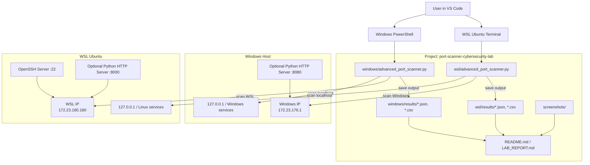
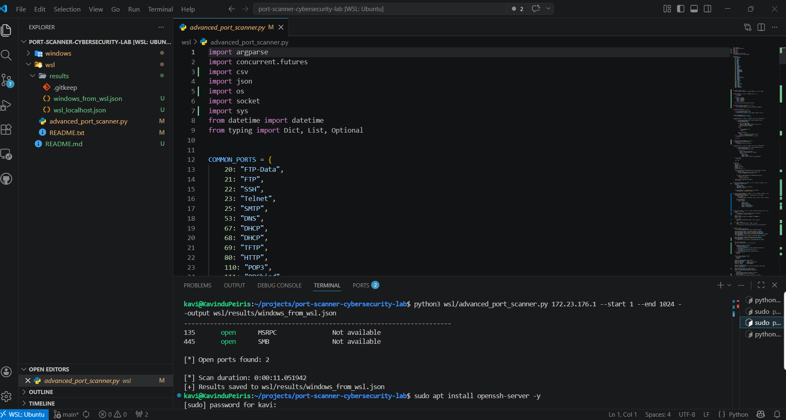

# Advanced TCP Port Scanner with Banner Grabbing

A Python-based TCP port scanner that detects open ports, identifies common services, and performs basic banner grabbing.

Built and tested in a Windows + WSL (Ubuntu 24.04.4 LTS) environment.

---

## Features

- TCP port scanning
- Service identification based on common ports
- Basic banner grabbing
- Multithreaded scanning for speed
- JSON output support
- CSV output support
- Works across Windows and WSL

---

## Environment

- Host: Windows with WSL enabled
- WSL: Ubuntu 24.04.4 LTS
- Language: Python 3
- Editor: VS Code

---

## Network Setup

| Component | IP Address |
| --- | --- |
| Windows (WSL-side) | 172.23.176.1 |
| WSL Instance | 172.23.180.180 |

---

## Lab Architecture



---

## Installation

### 1. Clone or download the project

```bash
git clone <your-repo-url>
cd port-scanner-cybersecurity-lab
```

### 2. Install dependencies in WSL

```bash
sudo apt update
sudo apt install python3 python3-pip nmap openssh-server net-tools -y
```

### 3. Run the scanner

From the `windows/` folder:

```powershell
python advanced_port_scanner.py 127.0.0.1 --start 1 --end 1024
```

From the `wsl/` folder:

```bash
python3 advanced_port_scanner.py 127.0.0.1 --start 1 --end 1024
```

If Windows `python` opens the Microsoft Store alias, use:

```powershell
& "C:\Users\kavin\AppData\Local\Programs\Python\Python313\python.exe" .\windows\advanced_port_scanner.py 127.0.0.1 --start 1 --end 1024
```

---

## Usage Examples

### Scan localhost

Windows:

```powershell
python advanced_port_scanner.py 127.0.0.1 --start 1 --end 1024
```

WSL:

```bash
python3 advanced_port_scanner.py 127.0.0.1 --start 1 --end 1024
```

### Scan Windows from WSL

```bash
python3 advanced_port_scanner.py 172.23.176.1 --start 1 --end 1024
```

### Scan WSL from Windows

```powershell
& "C:\Users\kavin\AppData\Local\Programs\Python\Python313\python.exe" .\windows\advanced_port_scanner.py 172.23.180.180 --start 1 --end 1024
```

### Save results to file

```powershell
python advanced_port_scanner.py 127.0.0.1 --output results/windows_localhost.json --csv-output results/windows_localhost.csv
```

---

## Sample Results

### WSL Localhost Scan

```text
PORT   STATE   SERVICE   BANNER
22     open    SSH       SSH-2.0-OpenSSH_9.6p1 Ubuntu-3ubuntu13.15
```


### WSL to Windows Scan

```text
PORT   STATE   SERVICE   BANNER
135    open    MSRPC     Not available
445    open    SMB       Not available
```



### HTTP Server Test

Attempted to run:

```bash
python3 -m http.server 8000
```

Error:

```text
OSError: [Errno 98] Address already in use
```


---

## How It Works

### 1. Port Scanning

Uses TCP `connect_ex()` to check whether a port is open.

### 2. Service Detection

Maps common ports to likely services, for example:

- 22 -> SSH
- 80 -> HTTP
- 445 -> SMB

### 3. Banner Grabbing

- Connects to open ports
- Reads service response when available
- Example:

```text
SSH-2.0-OpenSSH_9.6p1
```

---

## Lab Observations

- SSH service was successfully detected with a readable banner
- Windows exposed system services on port 135 and port 445
- Banner grabbing worked for SSH but not for all protocols
- WSL showed limited exposure because of NAT-based networking behavior
- The HTTP server test failed because port 8000 was already in use

---

## Limitations

- TCP scanning only
- No UDP support
- Basic banner grabbing
- No OS detection
- Results depend on active services
- WSL network isolation can affect visibility

---

## Comparison with Nmap

| Feature | This Tool | Nmap |
| --- | --- | --- |
| Port scanning | Yes | Yes |
| Service detection | Basic | Advanced |
| Banner grabbing | Limited | Detailed |
| OS detection | No | Yes |

---

## Learning Outcomes

- Understanding TCP port scanning
- Service identification
- Banner grabbing techniques
- WSL networking behavior
- Differences between custom tools and professional tools

---

## Project Structure

```text
port-scanner-cybersecurity-lab/
|-- README.md
|-- LAB_REPORT.md
|-- screenshots/
|-- windows/
|   |-- advanced_port_scanner.py
|   |-- README.txt
|   `-- results/
`-- wsl/
    |-- advanced_port_scanner.py
    |-- README.txt
    `-- results/
```


---

## Disclaimer

This project is for educational purposes only. Only scan systems you own or have permission to test.

---

